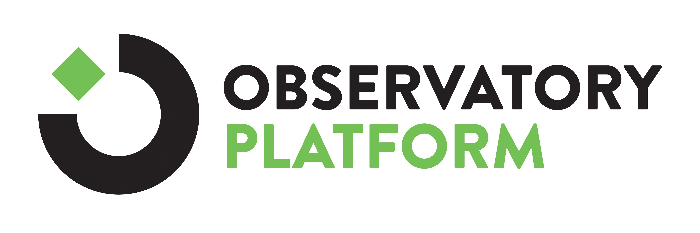
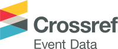
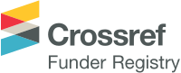
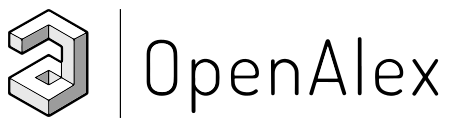
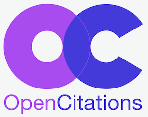
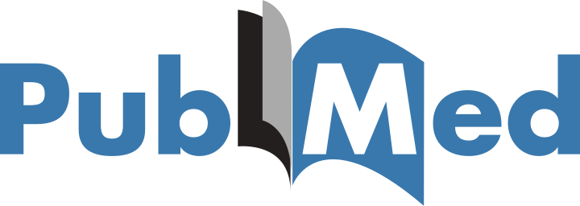
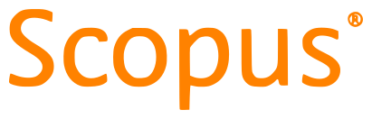
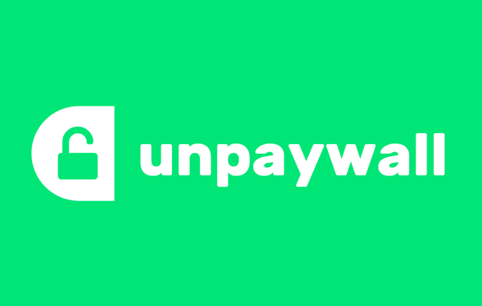

Academic Observatory Workflows provides Apache Airflow workflows for fetching, processing and analysing 
data about academic institutions.

## Telescope Workflows
A telescope a type of workflow used to ingest data from different data sources, and to run workflows that process and
output data to other places. Workflows are built on top of Apache Airflow's DAGs.

The workflows include: Crossref Events, Crossref Fundref, Crossref Metadata, Geonames, OpenAlex, Open Citations, ORCID, PubMed, ROR, Scopus, Unpaywall and Web of Science.

| Telescope Workflow  | Description |
| ------------- | ------------- |
|  | Crossref Event Data captures discussion on scholarly content and acts as a hub for the storage and distribution of this data. An event may be a citation in a dataset or patent, a mention in a news article, Wikipedia page or on a blog, or discussion and comment on social media.  |
|   | The Crossref Funder Registry is an open registry of grant-giving organization names and identifiers, which can be used to find funder IDs and include them as part of metadata deposits. It is a freely-downloadable RDF file. It is CC0-licensed and available to integrate with your own systems. Funder names from acknowledgements should be matched with the corresponding unique funder ID from the Funder Registry.  |
|   | Crossref is a non-for-profit membership organisation working on making scholarly communications better. It is an official Digital Object Identifier (DOI) Registration Agency of the International DOI Foundation. They provide metadata for every DOI that is registered with Crossref.  |
|   | The GeoNames geographical database covers all countries. It contains over 25 million geographical names and consists of over 11 million unique features whereof 4.8 million populated places and 13 million alternate names.  |
|   | OpenAlex is a free and open catalog of the global research system. |
|   | OpenCitations is an independent not-for-profit infrastructure organization for open scholarship dedicated to the publication of open bibliographic and citation data.  |
|   | ORCID is a non-profit organization that provides researchers with a unique digital identifier which eliminates the risk of confusing an identity with another researcher having the same name. ORCID provides a record that supports automatic links among all the researcher's professional activities.  |
|   | PubMed is a free resource supporting the search and retrieval of biomedical and life sciences literature with the aim of improving health–both globally and personally. |
|   | ROR is a global, community-led registry of open persistent identifiers for research organizations. |
|   | SCOPUS is an Elsevier bibliometrics database containing abstracts, citations, of journals, books, and conference proceedings.  |
|   | Unpaywall is an open database of free scholarly articles. It includes data from open indexes like Crossref and DOAJ where it exists. Data comes from “monitoring over 50,000 unique online content hosting locations, including Gold OA journals, Hybrid journals, institutional repositories, and disciplinary repositories.  |
|   | Web of science, previously Web of knowledge, provides bibliometric information, including funding acknowledgements, international publication identifiers, and abstracts.  |

## Documentation
For detailed documentation about the Academic Observatory see the Read the Docs website [https://academic-observatory-workflows.readthedocs.io](https://academic-observatory-workflows.readthedocs.io)
