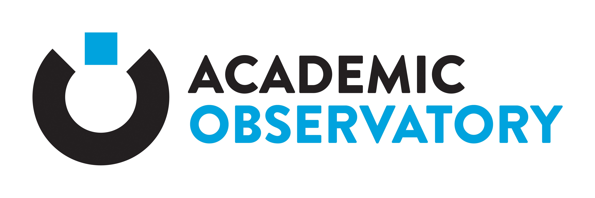
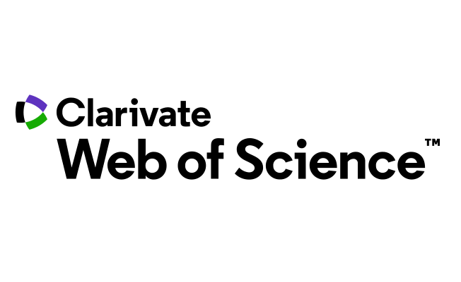

Academic Observatory Workflows provides Apache Airflow workflows for fetching, processing and analysing 
data about academic institutions.

## Telescope Workflows
A telescope a type of workflow used to ingest data from different data sources, and to run workflows that process and
output data to other places. Workflows are built on top of Apache Airflow's DAGs.

The workflows include: Crossref Events, Crossref Fundref, Crossref Metadata, Geonames, GRID, Microsoft Academic
Graph, Open Citations, ORCID, Scopus, Unpaywall and Web of Science.

| Telescope Workflow  | Description |
| ------------- | ------------- |
|  |   |
| 

  |   |
| 

  |   |
| 

  |   |
| 

  |   |
| 

  |   |
| 

  |   |
| 

  |   |
| 

  |   |
| 

  |   |
| 

  |   |

## Documentation
For detailed documentation about the Academic Observatory see the Read the Docs website [https://academic-observatory-workflows.readthedocs.io](https://academic-observatory-workflows.readthedocs.io)
